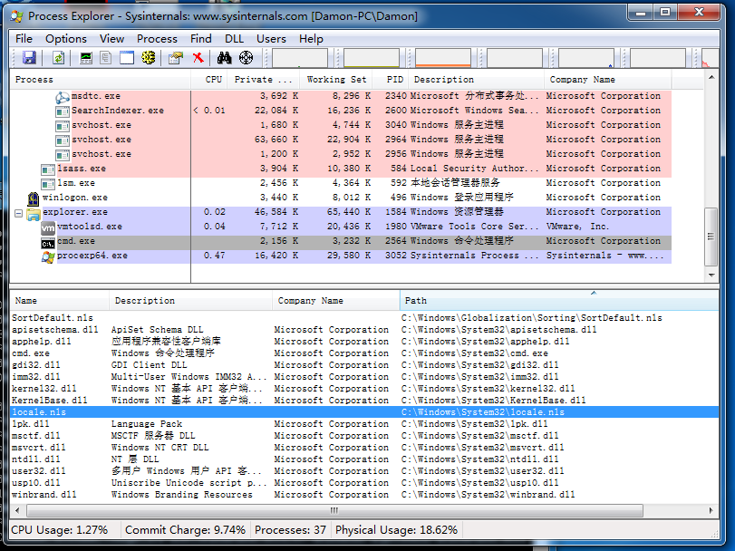
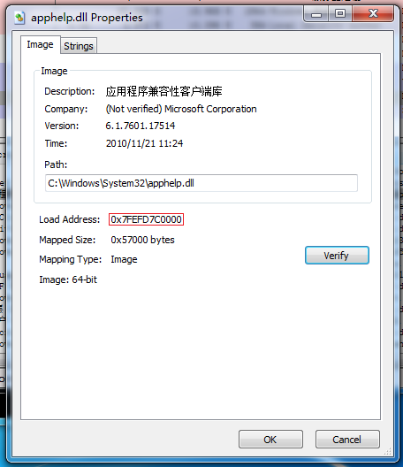
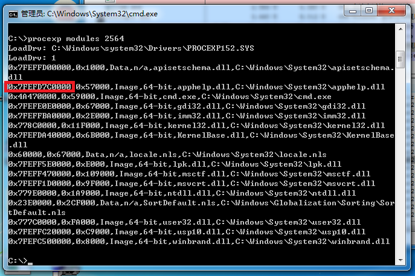
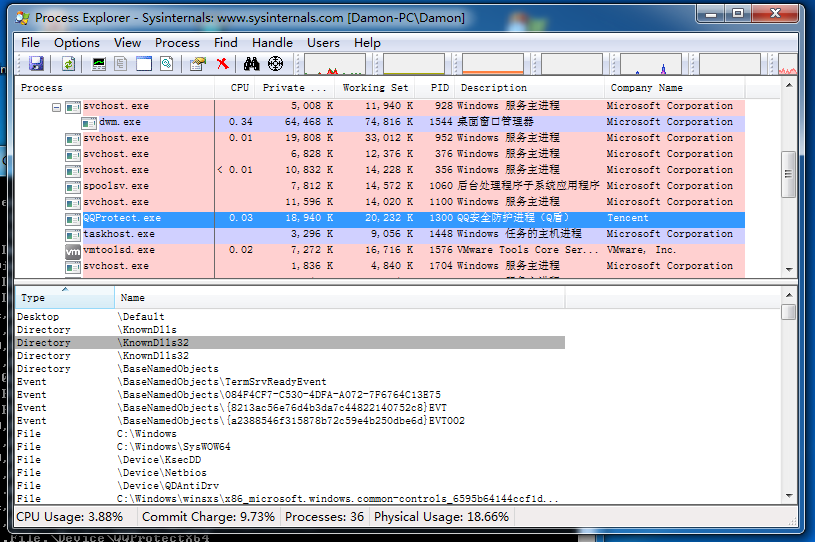
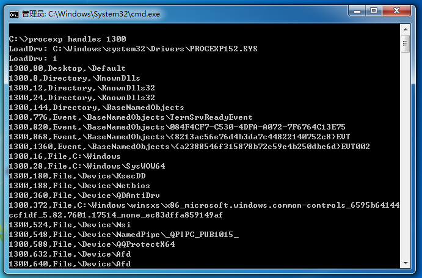

# ProcExp_ReverseEngineer

A command-line version [Process Explorer](https://technet.microsoft.com/en-us/sysinternals/processexplorer.aspx) clone.

Based on reverse engineering result of the original program.

## Usage

__This program should be run as administrator__. You can do this by starting it in a program which is already run as administrator. e.g. Press Win+X and choose "Command Prompt(Admin)".

Command-line:

```
procexp action pid

available actions:
	modules    list all modules(DLLs) of a process
    handles    list all handles of a process
```

Examples:

1. List all modules of the process with PID=812

```
procexp modules 812
```

2.List all drivers(a.k.a. system modules) loaded

```
procexp modules 4
```

3.Store all handles of the process with PID=808 in to a `.csv` file

```
procexp modules 808 > mod.csv
```

Then you can view the result in mod.csv using Excel.

## Screenshots & Comparsion

### Modules List







### Handles List





## Build

The .sln file here is a VS2015 solution file. If your VS is of a lower version, you can create you own solution, adding all `.cpp .h` files(except those in `driver` directory). It should compile as long as you have a non-express edition VS >=2005.

NOTE: if you use a custom solution, you must add `useRc32` macro to Resource Preprocessor Definitions of your x86 configuration.

## About the Driver

ProcExp's driver is just used as a helper to execute operations in kernel mode. (At least for the functions used in this program.)

Currently, this program uses the original driver file extracted from the resource of the original program (res id=150, try Resource Hacker). The reverse engineer of the original driver is in progress. Source code will be added later.

## Links

- [Process Explorer](https://technet.microsoft.com/en-us/sysinternals/processexplorer.aspx)
- [Microsoft withdraws Sysinternals source code](https://damieng.com/blog/2006/11/09/microsoft-withdraws-sysinternals-source-code)

---

kbridge
